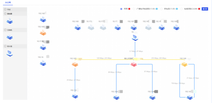

### 描述
> 基于snmp自动发现网络拓扑结构，并生成网络拓扑数据结构，输出结果主要包含nodes，links,即节点、连线，并定时进行每个端口的流量、错误数、广播包
> 丢包信息采集

### 运行
```shell
go build .
./netTopology
```

### 输出结果
```json
{
  "nodes":[
    {
      "name":"10.172.135.254",
      "alias":"",
      "type":"router",
      "x":0,
      "y":0,
      "ips":[
        "10.172.135.254"
      ],
      "locals":[
        "10.172.135.0/255.255.255.0",
        "10.172.135.255/255.255.255.255"
      ],
      "des_ips":{
        "GigabitEthernet0/0/0":[
          "10.172.135.1"
        ],
        "GigabitEthernet0/0/6":[
          "58.33.167.73"
        ]
      }
    }
  ],
  "links":[
    {
      "node_from":"GigabitEthernet0/0/1",
      "node_to":"",
      "node_from_name":"192.168.1.2",
      "node_to_name":"192.168.13",
      "value":0,
      "unit":"",
      "level":0,
      "if_index":"",
      "traffic_load":0,
      "port":"",
      "options":null
    }
  ],
  "location":false,
  "graph_id":"id1"
}
```

### 要做
> 后面将把前端展示的代码，以及结合手动编辑架构结合的功能加入进来，下图是一张基于本代码生产的数据进行后续前端展示的效果图

